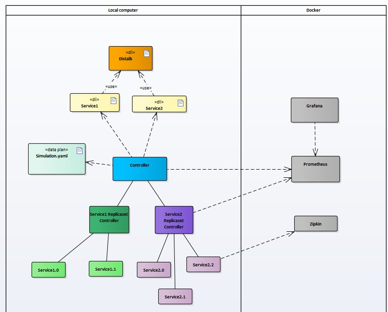

# ABOUT

Distlab is about simulating and observing distributed components. The main purpose of Distlab is to provide a ready to use infrastructure handling the life cycle of different processes and the communication between them, with an observability stack helping in monitoring those processes working together.

It is not an infrastructure meant to host production distributed applications, event though it is potentially able to manage the life cycle and the communication of processes among different computers. It is a tool box which allows you to simulate distributed applications, making proof of concepts, focusing more on the algorithm and the semantics of an application rather than on the complexity of deployment and communication handling.

Distlab is built on top of open source components. It runs either on Linux or Windows systems. Key components are the following one:

- A distlab C# library (.Net 5.0)
- Prometheus for the collection of metrics
- Zipkin for the collection of traces (Jaeger is also supported)
- Grafana for the dashboards

Even though you can use Distlab with any kind of editor, even with notepad, it is recommended to use it with VS Code because it will simplify the installation of the .Net 5.0 platform and bring you the ability to easily debug your simulation.\
Currently the implementation has to be done in C#, but it is not necessary to have a in depth knowledge of C# to be able to do interesting things, as the coding part strives to be as close to pseudo code as possible. 

# CONCEPTS
## COMPONENTS
The simplified view below shows some of the key components making the simulation runtime:


### <ins>The controller</ins>

This is the entry point of the simulation. It is launched with a single argument carrying the data plan name the controller needs to orchestrate. The controller needs three environment variables:
- DISTLAB_CONTAINER_PGM_PATH\
    this is the path to the container executable which wraps the services you will implement.
- DISTLAB_CONTAINERS_ASSEMBLY_ROOT\
    this the path to the folder containing the compiled services you want to deploy.
- DISTLAB_DATA_PLAN_ROOT\
    this is the path to the folder container data plans, the yaml file descriptors defining the workload you want to test.

The controller and the container wrapper are shiped with Distlab under the .controller and the .container folders.

Depending on the data plan, the controller will instanciate replicaset controllers in order to manage the life cycle of the services you want to deploy.

### <ins>The replicaset controller</ins>

A replicaset controller is in charge of the life cycle of a set of instances of the same service. The desired number of services to bring to life is defined in the data plan. Each service is assigned a specific index by the replicaset controller and a specific configuration can be bound to each of them through the dataplan.

### <ins>The container controller</ins>

This component is wrapping and monitoring the process container. It has a liveness probe which allows it to restart unresponsive processes. It handles one end of the communication link to a service instance. Actually, processes are hosted in a process container host which is an abstration on top of the service which allows the simulation to run your application components inside real processes or just as different threads on the controller process.

### <ins>The container</ins>
The container is the base of the service you want to implement. It holds the other end of the communication link which allows the service to communicate with other services. Among other things, it offers base methods to allow the service to manage specific metrics, call other services either synchronously or asynchronously and access the service configurations.

## SERVICES
These are the components of the distributed application you want to simulate. This is where Distlab works ends and yours starts. Each service needs to define a set of methods which corresponds to the semantic you want to put in place and you want to explore. The service is defined by a C# class deriving from the base Container class given by the distlab.dll library. It exposes a main() method which is invoked when the service is ready.\
You need to keep things simple and just focus on the semantics of the messages and the dynamics of the application.

## DATA PLAN
The data plan is defined with a yaml file and describes all the services you want to deploy and monitor. Main features are the following one:
- ability to describe a set of services to  orchestrate 
- specify the number of instances per service
- launch the services inside threads or processes
- specify the log level for the controller and for each service instance
- enable or disable the traces export
- export traces to zipkin or jaeger
- export prometheus metrics for the controller and for each service instance
- introduce communication delays for a specific service instance
- define custom configuration for a specific service instance
- define custom metrics for a specific service instance


# GETTING STARTED (TODO)

## PRE REQUISITE

### Grab docker 

### Grab vscode
### Clone distlab


## SETUP

The first time you need to create the observability stack.\
The stack will be installed in Docker with Prometheus, Zipklin and Grafana.\
Basic configuration ready to use with DISTLAB will be setup. If the configuration does not suit your need, you can modify it and reinstall the stack.

- Windows

    You need Docker for Desktop installed on your machine.

```cmd
distlab/.observability> build.bat
```
- Linux (TODO)

Once the stack created, next time just use:
- Windows

```cmd
distlab/.observability> start.bat
```

```cmd
distlab/.observability> stop.bat
```

- Linux (TODO)

Once the stack is launched, a simulation can be run; metrics and traces will be collected.

# OBSERVABILITY STACK


## PROMETHEUS

- A [default configuration](/.observability/prometheus/prometheus.yml) is provided which scrapes four different URLs. Those URLs are to be used in the data plan you want to launch.

    The four metrics servers are:

    ```cmd
    '127.0.0.1:7777', '127.0.0.1:7778', '127.0.0.1:7779', '127.0.0.1:7780'
    ```

    The local storage is used and is collected [here](/.observability/prometheus/data).

- In DISTLAB, for prometheus metrics, each metric agent defines an http server exposing the /metrics endpoint.\
    For a simulation launched in thread mode, only one server should be used for the controller. Other prometheus configuration at service level should be disabled in the data plan.

    server 1: http://127.0.0.1:7777/metrics\
    server 2: http://127.0.0.1:7778/metrics\
    server 3: http://127.0.0.1:7779/metrics\
    server 4: http://127.0.0.1:7780/metrics

- Prometheus UI is available here after launch: [http://127.0.0.1:9090/](http://127.0.0.1:9090/)    

### DEFAULT METRICS 

- controller

    there is a metric agent for the controller which is responsible of collecting the metrics for controller and replicas

    - MetricType.gauge, "replicaset", "Number of replicasets.", "dataPlan"

- replicaset controller

    - MetricType.gauge, "replicas", "Number of replicas.", "dataPlan", "service"

- container controller

    - MetricType.counter, "msg", "Number of messages.", "direction", "service", "index"
    - MetricType.counter, "restart", "Number of service restart.", "service"
    - MetricType.gauge, "start", "Time to start container in ms.", "service"
    - MetricType.gauge, "stop", "Time to stop container in ms.", "service"

- container

    - MetricType.gauge, "latency", "Network latency.", "service", "index"
    - MetricType.gauge, "execution", "Execution duration.", "service", "operation", "index"
    - MetricType.counter, "msg", "Number of messages.", "direction", "service", "index"
    - MetricType.counter, "timeout", "Number of timeouts.", "service", "operation", "index"
    - specific metrics

### THREAD OR PROCESS

There is one metric agent per container, so for each service instance, if the configuration specifies prometheus or trace enabled. So, per process, there is a clean separation between prometheus exporter instances.\
When launch per thread, all prometheus exporters listens to all metrics because they are static. The configuration should eenable the prometheus on controller only in that case.
## ZIPKIN

Zipkin is used by the obervability strack to collected correlated traces.\
No persistence is used between simulation runs. You may export them from Zipkin UI after a simulation run.
- Zipkin UI is available here after launch: [http://127.0.0.1:9411/](http://127.0.0.1:9411/)   

## GRAFANA
Grafana is used to provide dashboards to DISTLAB. Dashboards are connected to the Prometheus instance.\
Default dashboards are provided to help monitoring a simulation status.\
Specific dashboards should be developped depending on the different aspects of your simulation you want to track.
- Grafan UI is available here after launch: [http://127.0.0.1:9030/](http://127.0.0.1:9030/) 